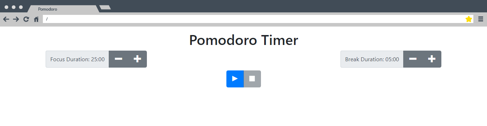
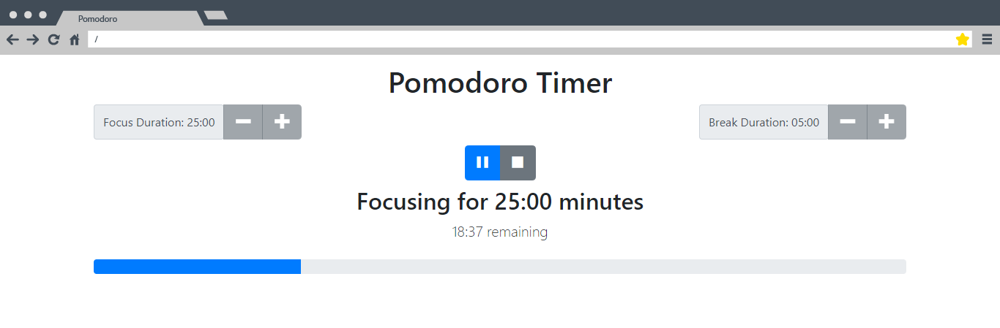
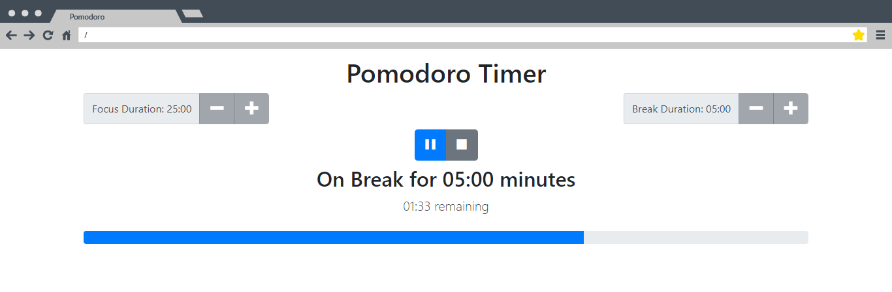

#
# Pomomdoro Timer

Thinkful student project built using React and Bootstrap. The Pomodoro Technique is a time management method. A timer divides time into focus and break sessions. A user focuses (for 25 minutes by default) and takes a break (for 5 minutes by default). Focus sessions can be adjust in 5 minute increments between 5 and 60 minutes. Break sessions can be 1 to 15 minutes in 1 minute increments. 

#
## LINKS
[App](https://pomodoro-rosy-seven.vercel.app/)

#
## SKILLS USED
* React 
* Javascript
* HTML / JSX 
* CSS
* Bootstrap
* useState React Hooks

#
## FUTURE FEATURES

Some features that I would like to impliment in the future

* Sound options
* Fix some minor responsiveness issues

#
## SCREENSHOTS

### Home Page:
By default the focus duration is 25 minutes and the break duration is 5 minutes.

### Running Timer:
Once the pomodoro has started running, the duration buttons are grayed out and pause/ stop buttons become available.

### On Break:
When the focus session ends, the on break session runs.
